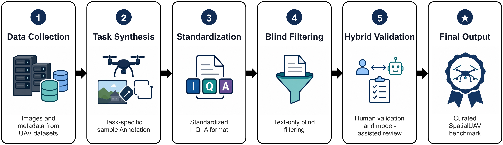
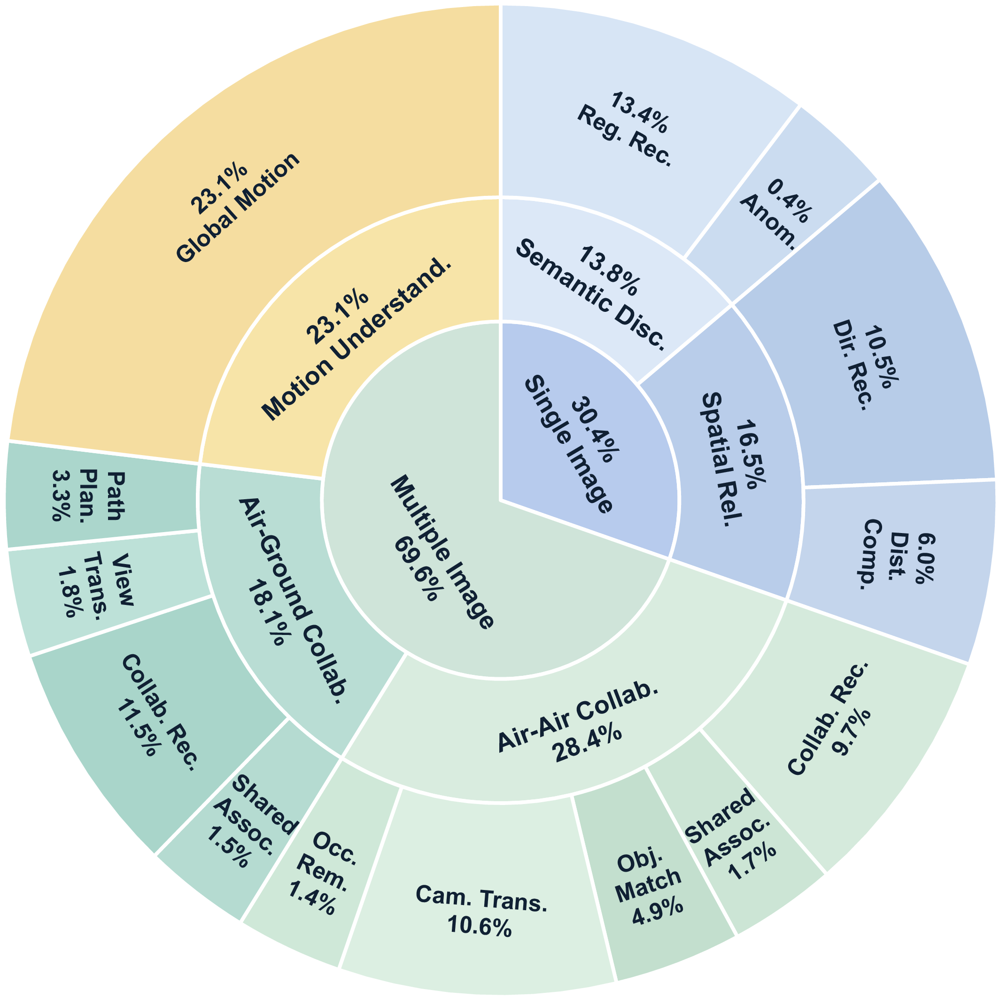
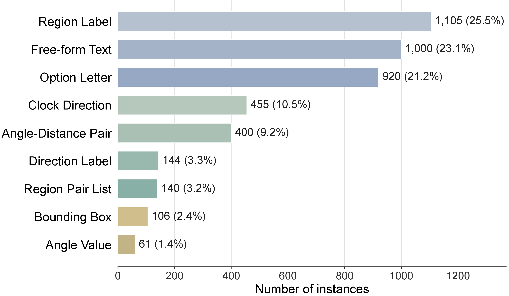
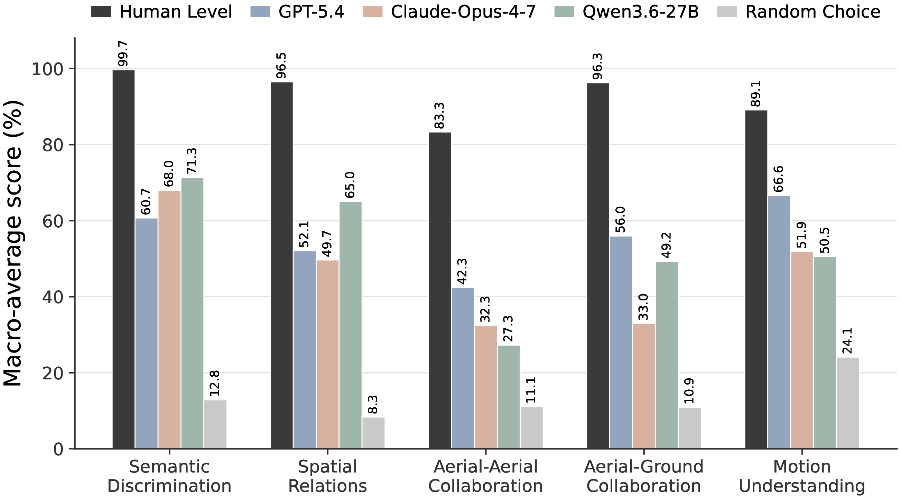

# SpatialUAV

<!-- Replace placeholder links after the public release. -->
[](<https://huggingface.co/datasets/Hyu-Zhang/SpatialUAV>)
[](<PAPER_URL>)
[](<LICENSE_URL>)

**SpatialUAV** is a benchmark for evaluating spatial intelligence in real
low-altitude UAV scenarios. It covers perception, spatial relation reasoning,
aerial-aerial collaboration, aerial-ground collaboration, and UAV motion
understanding under a unified visual-question-answer format.

<p align="center">
  
</p>

## Highlights

- **4,331 curated instances** from real low-altitude UAV images, videos, and metadata.
- **14 task types** across semantic discrimination, spatial relations,
  aerial-aerial collaboration, aerial-ground collaboration, and motion understanding.
- **7 visual input configurations** covering single images, paired views,
  candidate-view selection, annotated images, and ordered video frames.
- **9 answer formats**, including option labels, region IDs, region pairs,
  bounding boxes, angle-distance values, movement directions, and free-form text.
- **Task-specific evaluation** for heterogeneous outputs instead of relying on
  one generic text metric.

## Benchmark Overview

<p align="center">
  
</p>

SpatialUAV standardizes every sample into a visual-input, question, and answer
record. Its construction pipeline combines detector-assisted regions, depth
supervision, metadata-derived rules, manual annotation, blind filtering, and
multi-round validation.

| Group | Task Types | Main Capability |
| --- | --- | --- |
| Semantic Discrimination | Region Recognition, Anomaly Detection | Recognize queried objects and safety-critical regions |
| Spatial Relation | Direction Recognition, Distance Comparison | Infer direction and relative depth from UAV views |
| Aerial-Aerial Collaboration | Collaboration Recognition, Shared Association, Object Matching, Camera Transformation, Occlusion Removal | Match and reason across multiple UAV viewpoints |
| Aerial-Ground Collaboration | Shared Association, Collaboration Recognition, View Translation, Path Planning | Align aerial and ground observations |
| Motion Understanding | Global Motion | Describe UAV/camera motion over ordered frames |

<p align="center">
  
</p>

<p align="center">
  
</p>

## Data Format

The annotation file is JSONL. Each line is one benchmark instance:

```json
{
  "id": "A2A_Object_Matching_00001",
  "image": [
    "./SpatialUAV/samples_A2A_detected/example_view_1.jpg",
    "./SpatialUAV/samples_A2A_detected/example_view_2.jpg"
  ],
  "conversations": [
    {
      "from": "human",
      "value": "Which bounding box in image1 corresponds to Region 0 in image2?"
    }
  ],
  "source": "SpatialUAV",
  "GT": "[100, 120, 240, 260]"
}
```

Expected dataset layout after download:

```text
SpatialUAV/
  annotations.jsonl
  annotations_subset_20pct_per_task.jsonl
  samples_Single_Image/
  samples_A2A_*/
  samples_A2G_*/
  samples_Motion_Understanding_Frames/
```

Use `annotations_subset_20pct_per_task.jsonl` for quick checks and
`annotations.jsonl` for full benchmark evaluation.

## Installation

Create an environment and install the common dependencies:

```bash
pip install -U pillow openai google-genai anthropic
```

Local model backends require their own model environments, for example
`torch`, `transformers`, `accelerate`, `torchvision`, and `qwen-vl-utils`.
Install the dependencies recommended by the corresponding model repository.

## Inference

All model families are launched through one script:

```bash
python run_spatialuav_inference.py \
  --backend qwen \
  --model /path/to/model \
  --annotations /path/to/SpatialUAV/annotations.jsonl \
  --output predictions/predictions_qwen.jsonl
```

Supported backends:

| Backend | Usage |
| --- | --- |
| `autodl` | OpenAI, Anthropic, or Gemini compatible API inference |
| `cambrian` | Local Cambrian-S style checkpoints |
| `internvl35` | Local InternVL3.5 checkpoints |
| `qwen` | Local Qwen text or vision-language checkpoints |
| `spatialvlm` | Qwen2.5-VL compatible SpatialVLM-style checkpoints |
| `vst` | Local VST-7B-SFT checkpoints |

Common options:

```bash
--task-prefix Region_Recognition A2A_Object_Matching
--limit 100
--offset 0
--image-limit 8
--resume
--continue-on-error
--max-tokens 512
--temperature 0
```

Examples:

```bash
python run_spatialuav_inference.py --backend cambrian --model /path/to/Cambrian-S-7B
python run_spatialuav_inference.py --backend internvl35 --model /path/to/InternVL3_5-8B
python run_spatialuav_inference.py --backend vst --model /path/to/VST-7B-SFT --no-motion-as-video
python run_spatialuav_inference.py --backend autodl --provider openai --model <served-model-name>
```

## Evaluation

Evaluate predictions with:

```bash
python eval_spatialuav.py \
  --predictions predictions/predictions_qwen.jsonl \
  --annotations /path/to/SpatialUAV/annotations.jsonl \
  --output-json results/summary_qwen.json
```

The evaluator uses task-specific metrics:

| Output Type | Evaluation |
| --- | --- |
| Region IDs | set matching / partial-region score |
| Option labels | exact option accuracy |
| Region pairs | pair-level precision, recall, and F1 |
| Bounding boxes | IoU and center-aware geometry score |
| Camera transformation | angle and distance error thresholds |
| Path planning direction | exact direction accuracy |
| Motion description | semantic judge or local token-F1 fallback |

For environments without an external judge API, use the local fallback:

```bash
python eval_spatialuav.py \
  --predictions predictions/predictions_qwen.jsonl \
  --annotations /path/to/SpatialUAV/annotations.jsonl \
  --motion-judge-mode token_f1
```

## Results

<p align="center">
  
</p>

SpatialUAV is designed as a diagnostic benchmark. Current VLMs show stronger
performance on recognition-style tasks, while cross-view association,
structured grounding, geometric transformation, and temporal UAV motion remain
substantially harder.

## Paper

**SpatialUAV: Benchmarking Spatial Intelligence for Low-Altitude UAV
Perception, Collaboration, and Motion**

Citation information will be updated after the paper release.
